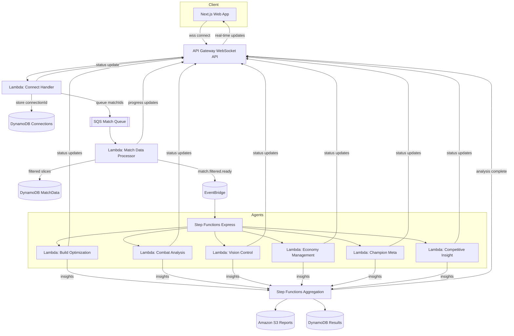

# HexCoreAI

HexCoreAI is an AI-powered League of Legends companion that transforms full-year match history into personalized retrospectives. By combining the League Developer API with AWS AI services, the agent helps every player reflect, learn, and celebrate through authentic insights that go beyond community dashboards.

## Project Overview

- **Mission**
  Deliver year-end recaps that surface strengths, habits, standout games, and growth paths using generative AI on AWS.
- **Audience**
  League players who want actionable coaching, fun storytelling, and social sharing based on their own match data.

## Key Capabilities

- **Personalized retrospectives**
  Generate narrative summaries, highlight reels, and creative year-in-review stories tailored to each player.
- **Insights & coaching**
  Identify consistent strengths, weaknesses, matchup trends, and role-specific recommendations.
- **Progress visualizations**
  Chart ranked performance, champion mastery, and macro stats over time.
- **Social comparisons**
  Benchmark against friends, track duo synergies, and surface complementary playstyles.
- **Shareable moments**
  Produce media-ready snippets and graphics for social platforms to celebrate accomplishments.

## Serverless Architecture



- **Real-time initiation**
  `API Gateway` WebSocket connections invoke a `Lambda` connect handler that stores session metadata in a `DynamoDB` Connections table, enqueues yearly match IDs to `SQS`, and acknowledges the user.
- **Filtered data staging**
  The `Match Data Processor` Lambda streams batches from `SQS`, fetches Riot `MATCH-V5`/timeline payloads, filters to agent-ready slices, writes to the `DynamoDB` MatchData table, and emits progress over the WebSocket.
- **Event-driven analysis**
  `EventBridge` publishes `match.filtered.ready` events that trigger a `Step Functions Express` workflow, fanning out to six specialized agent Lambdas operating on the filtered data.
- **Insight synthesis**
  The orchestration layer aggregates agent outputs, persists final artifacts to `Amazon S3`/`DynamoDB`, and pushes completion notifications back through the WebSocket.
- **Continuous feedback**
  Every stage reuses the stored connectionId to send live status messages, keeping the client informed from ingestion through synthesis without polling.

## Data Pipeline Focus Areas

- **Growth tracking**
  Aggregate multi-patch metrics to highlight mechanical and macro improvements.
- **Champion mastery**
  Surface pick-rate shifts, win delta, and styling cues for main champions.
- **Match storytelling**
  Detect highlight matches, clutch comebacks, or tilt streaks for curated narratives.
- **Community engagement**
  Map player's ecosystem to enable comparisons, duo insights, and shareable cards.

## Tech Stack

- **TypeScript**
  Strong typing across API/agent layers.
- **Next.js**
  Full-stack app that delivers dashboards, retrospectives, and sharing flows.
- **TailwindCSS**
  Rapid UI composition aligned with HexCoreAI branding.
- **shadcn/ui**
  Accessible, customizable component library.
- **Husky**
  Git hooks to protect commit quality.
- **Turborepo**
  Monorepo orchestration for apps and infrastructure packages.

## Getting Started

- **Install dependencies**

```bash
pnpm install
```

- **Run the dev server**

```bash
pnpm dev
```

Visit [http://localhost:3001](http://localhost:3001) to explore the HexCoreAI web experience.

## Project Structure

```
hexcore-ai/
├── apps/
│   ├── web/         # Next.js frontend for dashboards and retrospectives
```

## Available Scripts

- `pnpm dev`
  Start all applications in development mode.
- `pnpm build`
  Build all applications.
- `pnpm dev:web`
  Start only the web application.
- `pnpm check-types`
  Run TypeScript checks across all apps.
