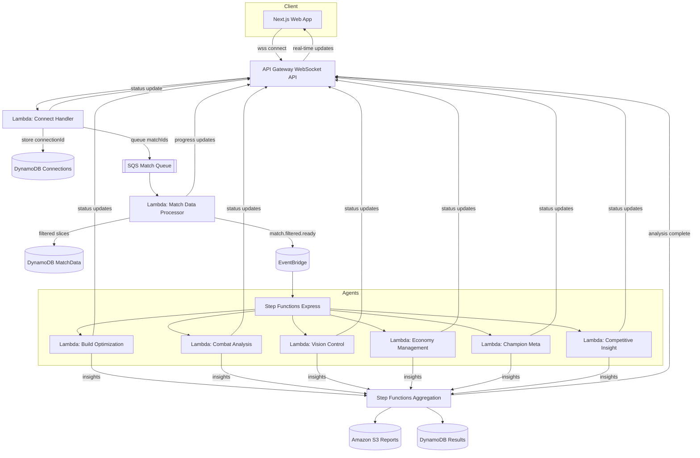

# HexCore AI - League of Legends Match Analysis Platform

HexCore AI is a serverless, event-driven platform that analyzes League of Legends match data using multi-agent AI analysis. The system fetches match data from Riot's API, processes it through specialized AI agents, and delivers real-time insights via WebSocket to a Next.js web application.

## Project Overview

**Key Features**:
- Real-time match analysis with WebSocket progress updates
- Multi-agent AI system (6 specialized agents analyzing different game aspects)
- Serverless architecture on AWS (API Gateway, Lambda, DynamoDB, Step Functions)
- Modern Next.js frontend with TailwindCSS and shadcn/ui components

## Architecture

### High-Level Flow
```
Next.js Client → API Gateway WebSocket → Lambda (Connect) → SQS Queue
                                                              ↓
                                                    Lambda (Match Processor)
                                                              ↓
                                                    DynamoDB (Filtered Data)
                                                              ↓
                                                    EventBridge → Step Functions
                                                              ↓
                                            6 Agent Lambdas (Parallel Analysis)
                                                              ↓
                                                    Aggregation & Synthesis
                                                              ↓
                                                    Final Results (S3/DynamoDB)
```

### Core Components
1. **Next.js Web App** (`apps/web`): User-facing application with WebSocket client
2. **AWS Backend** (`apps/aws`): SAM-based serverless infrastructure with TypeScript Lambdas
3. **6 AI Agents**: Build, Combat, Vision, Economy, Champion Meta, Competitive Insight analyzers
4. **WebSocket API**: Real-time bidirectional communication for progress updates
5. **Event-Driven Pipeline**: SQS → EventBridge → Step Functions orchestration

## Serverless Architecture



- **Real-time initiation**
  `API Gateway` WebSocket connections invoke a `Lambda` connect handler that stores session metadata in a `DynamoDB` Connections table, enqueues yearly match IDs to `SQS`, and acknowledges the user.
- **Filtered data staging**
  The `Match Data Processor` Lambda streams batches from `SQS`, fetches Riot `MATCH-V5`/timeline payloads, filters to agent-ready slices, writes to the `DynamoDB` MatchData table, and emits progress over the WebSocket.
- **Event-driven analysis**
  `EventBridge` publishes `match.filtered.ready` events that trigger a `Step Functions Express` workflow, fanning out to six specialized agent Lambdas operating on the filtered data.
- **Insight synthesis**
  The orchestration layer aggregates agent outputs, persists final artifacts to `Amazon S3`/`DynamoDB`, and pushes completion notifications back through the WebSocket.
- **Continuous feedback**
  Every stage reuses the stored connectionId to send live status messages, keeping the client informed from ingestion through synthesis without polling.

## Data Pipeline Focus Areas

- **Growth tracking**
  Aggregate multi-patch metrics to highlight mechanical and macro improvements.
- **Champion mastery**
  Surface pick-rate shifts, win delta, and styling cues for main champions.
- **Match storytelling**
  Detect highlight matches, clutch comebacks, or tilt streaks for curated narratives.
- **Community engagement**
  Map player's ecosystem to enable comparisons, duo insights, and shareable cards.

## Technology Stack

### Frontend (`apps/web`)
- **Framework**: Next.js 15.5 with App Router, React 19, Turbopack
- **Styling**: TailwindCSS 4.1, shadcn/ui components, Lucide icons
- **State**: TanStack React Query, TanStack React Form
- **Validation**: Zod
- **Theme**: next-themes (dark mode support)
- **Notifications**: Sonner toasts
- **WebSocket**: react-use-websocket for real-time communication

### Backend (`apps/aws`)
- **IaC**: AWS SAM (CloudFormation-based)
- **Runtime**: Node.js with TypeScript
- **Services**:
  - API Gateway WebSocket API
  - Lambda (Connect, Disconnect, Match Processor, 6 Agents, Synthesizer)
  - DynamoDB (Connections, MatchData tables with TTL)
  - SQS (Standard queue + DLQ)
  - EventBridge (event routing)
  - Step Functions Express (orchestration)
  - S3 (final results storage)
  - Secrets Manager (Riot API key)
  - CloudWatch (logging, metrics, alarms)
  - X-Ray (tracing)

### Development Tools
- **Monorepo**: Turborepo with pnpm workspaces
- **Linting**: Biome, Ultracite
- **Git Hooks**: Husky with lint-staged
- **Package Manager**: pnpm 10.15.0

## Getting Started

### Prerequisites
- Node.js 18+ 
- pnpm 10.15.0+
- AWS CLI configured (for backend deployment)
- AWS SAM CLI (for backend deployment)

### Development Setup

**Install dependencies**
```bash
pnpm install
```

**Start all applications in development mode**
```bash
pnpm run dev
```
This starts both the Next.js web app (port 3001) and fumadocs site.

**Start only the web application**
```bash
pnpm run dev:web
```

**Backend development**
```bash
cd apps/aws
pnpm run build    # Build TypeScript
pnpm run local    # Run SAM local
pnpm run deploy   # Deploy to AWS
```

Visit [http://localhost:3001](http://localhost:3001) to explore the HexCoreAI web experience.

## Project Structure

```
HexCoreAI/
├── apps/
│   ├── web/                    # Next.js 15 frontend (port 3001)
│   │   ├── src/
│   │   │   ├── app/           # Next.js App Router pages
│   │   │   ├── components/    # React components (shadcn/ui)
│   │   │   └── lib/           # Utilities and helpers
│   │   ├── package.json
│   │   └── next.config.ts
│   │
│   ├── aws/                    # AWS SAM backend (TypeScript)
│   │   ├── template.yaml      # SAM IaC template
│   │   ├── samconfig.toml     # SAM CLI configuration
│   │   ├── package.json       # TypeScript dependencies
│   │   ├── tsconfig.json
│   │   ├── src/
│   │   │   ├── websocket/
│   │   │   │   ├── connect.ts       # WebSocket $connect handler
│   │   │   │   └── disconnect.ts    # WebSocket $disconnect handler
│   │   │   ├── processor/
│   │   │   │   └── matchProcessor.ts  # SQS-triggered match fetcher
│   │   │   ├── agents/
│   │   │   │   ├── buildAgent.ts          # Build optimization
│   │   │   │   ├── combatAgent.ts         # Combat analysis
│   │   │   │   ├── visionAgent.ts         # Vision control
│   │   │   │   ├── economyAgent.ts        # Economy management
│   │   │   │   ├── championAgent.ts       # Champion meta
│   │   │   │   └── competitiveAgent.ts    # Competitive insights
│   │   │   ├── aggregation/
│   │   │   │   └── synthesizer.ts   # Results aggregation
│   │   │   └── shared/
│   │   │       ├── websocketClient.ts  # WebSocket utilities
│   │   │       ├── riotApi.ts          # Riot API client
│   │   │       └── types.ts            # Shared TypeScript types
│   │   └── statemachine/
│   │       └── multi-agent-orchestration.asl.json
│   │
│   └── fumadocs/               # Documentation site (Fumadocs)
│
├── docs/                       # Architecture & implementation guides
│   ├── HexCoreAi_architecture_design.md
│   ├── HexCoreAI_assistant_implementation_guide.md
│   └── HexCoreAI_dev_implementation_guide.md
│
├── package.json               # Root workspace config
├── pnpm-workspace.yaml        # pnpm workspaces
├── turbo.json                 # Turborepo config
└── biome.json                 # Biome linter config
```

## Available Scripts

### Root Level Commands
- `pnpm run dev` - Start all applications in development mode
- `pnpm run build` - Build all applications  
- `pnpm run check` - Run Biome linter/formatter across all code
- `pnpm run check-types` - Run TypeScript checks across all apps
- `pnpm run dev:web` - Start only the web application (port 3001)
- `pnpm run dev:fumadocs` - Start only the documentation site

### Backend Commands (`apps/aws`)
- `pnpm run build` - Build TypeScript Lambda functions
- `pnpm run clean` - Clean build artifacts
- `pnpm run watch` - Watch mode for TypeScript compilation
- `pnpm run deploy` - Deploy to AWS (build + SAM deploy)
- `pnpm run local` - Run SAM local for local testing

### Frontend Commands (`apps/web`)
- `pnpm run dev` - Start Next.js dev server with Turbopack (port 3001)
- `pnpm run build` - Build Next.js application
- `pnpm run start` - Start production server

## Key Implementation Details

### WebSocket Connection Flow
1. Client connects with sessionId and puuid query parameters
2. Connect handler stores connectionId in DynamoDB and queues match IDs to SQS
3. Match processor batches 10 matches, fetches from Riot API, filters data
4. Filtered data stored in DynamoDB, EventBridge event published
5. Step Functions triggers 6 parallel agent Lambdas for analysis
6. Results aggregated and stored in S3/DynamoDB
7. Real-time progress updates sent via WebSocket throughout

### Multi-Agent System
The platform uses 6 specialized AI agents:
- **Build Agent**: Analyzes item builds and optimization
- **Combat Agent**: Evaluates fighting patterns and KDA performance  
- **Vision Agent**: Assesses warding and map control
- **Economy Agent**: Tracks CS, gold generation, and economic efficiency
- **Champion Agent**: Provides champion-specific insights and meta analysis
- **Competitive Agent**: Delivers strategic and competitive insights

### AWS Infrastructure
- **Serverless**: All services run on AWS serverless components
- **Event-Driven**: SQS → EventBridge → Step Functions orchestration
- **Real-Time**: WebSocket API for live progress updates
- **Scalable**: Auto-scaling Lambda, on-demand DynamoDB, SQS buffering
- **Cost-Optimized**: Pay-per-use model with TTL-based cleanup

## Development Workflow

### Code Quality
```bash
pnpm run check            # Run Biome linter/formatter
pnpm dlx ultracite fix    # Auto-fix linting issues
```

### Git Hooks
Pre-commit hooks automatically run linting and formatting to ensure code quality.

### Documentation
Comprehensive documentation available in `/docs` and via the fumadocs site.
