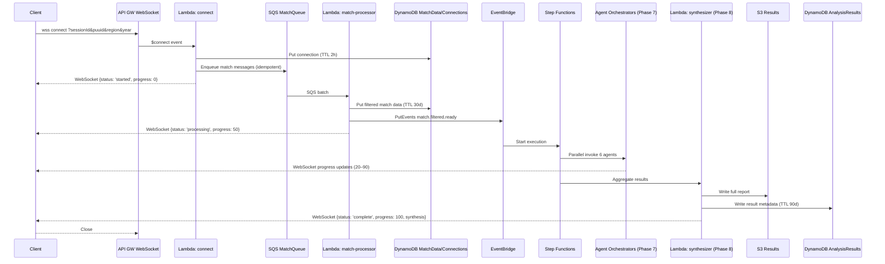

# HexCore AI Implementation Phases

This directory contains the sharded implementation guide organized by phases and tasks. Each phase has its own directory with individual task files.

## Directory Structure

```
phases/
├── README.md (this file)
├── phase-01/          # Project Structure & Configuration
│   ├── README.md
│   ├── task-16-initialize-project-structure.md
│   └── task-17-configure-typescript-build-environment.md
├── phase-02/          # Infrastructure as Code (SAM Template)
│   ├── README.md
│   ├── task-21-create-core-sam-template.md
│   ├── task-22-define-parameters.md
│   ├── task-23-define-dynamodb-tables.md
│   ├── task-24-define-sqs-queues.md
│   ├── task-25-define-s3-bucket.md
│   ├── task-26-define-api-gateway-websocket.md
│   ├── task-27-define-lambda-functions.md
│   ├── task-28-define-eventbridge-step-functions.md
│   ├── task-29-define-cloudwatch-alarms.md
│   └── task-210-define-outputs.md
├── phase-03/          # Shared Utilities & Type Definitions
├── phase-04/          # WebSocket Handlers
├── phase-05/          # Match Data Processor
├── phase-06/          # Step Functions State Machine
├── phase-07/          # Agent Lambda Functions
├── phase-08/          # Results Aggregation & Synthesis
├── phase-09/          # User Validation & Testing
├── phase-10/          # Client Web App (Next.js) WebSocket Integration
└── phase-11/          # Multi-Agent System Expansion with Third-Party API Integration
```

## Phase Overview

### [Phase 1: Project Structure & Configuration](./phase-01/) ✅
**Status:** Completed  
**Tasks:** 2

Sets up the foundational project structure and TypeScript build environment.

- Task 1.6: Initialize Project Structure ✅
- Task 1.7: Configure TypeScript Build Environment ✅

### [Phase 2: Infrastructure as Code (SAM Template)](./phase-02/) ✅
**Status:** Completed  
**Tasks:** 13

Defines all AWS infrastructure resources using SAM/CloudFormation.

- Task 2.1: Create Core SAM Template ✅
- Task 2.2: Define Parameters ✅
- Task 2.3: Define DynamoDB Tables ✅
- Task 2.4: Define SQS Queues ✅
- Task 2.5: Define S3 Bucket ✅
- Task 2.6: Define API Gateway WebSocket ✅
- Task 2.7: Define Lambda Functions ✅
- Task 2.8: Define EventBridge & Step Functions ✅
- Task 2.9: Define CloudWatch Alarms ✅
- Task 2.10: Define Outputs ✅

### [Phase 3: Shared Utilities & Type Definitions](./phase-03/)
**Status:** Completed  
**Tasks:** 4

Implements shared utilities, type definitions, and helper modules.

- Task 3.1: Create TypeScript Type Definitions ✅
- Task 3.2: Create Constants Module ✅
- Task 3.3: Create Riot API Client Module ✅
- Task 3.4: Create WebSocket Utility Module ✅

### [Phase 4: WebSocket Handlers](./phase-04/) ✅
**Status:** Completed  
**Tasks:** 2

Implements WebSocket connection and disconnection handlers.

- Task 4.1: Implement WebSocket Connect Handler ✅
- Task 4.2: Implement WebSocket Disconnect Handler ✅

### [Phase 5: Match Data Processor](./phase-05/) ✅
**Status:** Completed  
**Tasks:** 1

Implements the SQS-triggered match data processor.

- Task 5.1: Implement Match Processor Lambda ✅

### [Phase 6: Step Functions State Machine](./phase-06/) ✅
**Status:** Completed  
**Tasks:** 1

Defines the multi-agent orchestration state machine.

- Task 6.1: Create Step Functions Definition ✅

### [Phase 7: AI Analysis Layer - Bedrock Agents](./phase-07/)
**Status:** In Progress  
**Tasks:** 17 (across 5 subphases)

Implements Bedrock Agents with Action Groups and orchestrators, streaming invocation, and trace events. See `phase-07/README.md` for detailed subphases and tasks.

### [Phase 8: Results Aggregation & Synthesis](./phase-08/)
**Status:** In Progress  
**Tasks:** 1

Implements the results synthesizer that aggregates agent outputs.

- Task 8.1: Implement Synthesizer Lambda 🔄

### [Phase 9: User Validation & Testing](./phase-09/)
**Status:** Ready  
**Tasks:** Manual validation plan covering Phases 1–8

Defines a comprehensive manual end-to-end test plan for the backend in the `test` stage, including WebSocket lifecycle, SQS ingestion, DynamoDB writes with TTL, EventBridge trigger to Step Functions, and final synthesis delivery to S3/DynamoDB + WebSocket.

### [Phase 10: Next.js Client WebSocket Integration](./phase-10/)
**Status:** Ready  
**Tasks:** 7

Implements a production-ready Next.js client that connects to the AWS API Gateway WebSocket and receives real-time analysis updates using `react-use-websocket` and React Context.

- Task 10.1: Install Client Dependencies
- Task 10.2: Create WebSocket Context Provider
- Task 10.3: App-Level Integration
- Task 10.4: Analysis Dashboard Component
- Task 10.5: Environment Configuration
- Task 10.6: Custom Hook: useAnalysisProgress
- Task 10.7: Testing & Verification

### [Phase 11: Multi-Agent System Expansion with Third-Party API Integration](./phase-11/)
**Status:** Pending  
**Tasks:** 5

Integrates community data sources (U.GG, OP.GG, Community Dragon, Data Dragon, LoLalytics, Mobalytics) to enhance agent analysis with meta-aware insights, benchmarking, and matchup intelligence.

- Task 11.1: Update Existing Agent Action Groups with External API Integration
- Task 11.2: Define and Configure New Specialized Agents
- Task 11.3: Implement Action Groups for New Specialized Agents
- Task 11.4: Implement Orchestrators for New Specialized Agents
- Task 11.5: Updated Riot API Client Module

## End-to-End WebSocket Analysis Flow (once all phases are complete)

This section describes the full, single-request flow from the client through to final results delivery over WebSocket, as implemented across Phases 1–9.

- **[Connect]** Client opens a WebSocket connection to API Gateway with `sessionId`, `puuid`, `region`, `year`.
- **[Seed Work]** `connect` Lambda validates params, stores connection in `Connections` table (2h TTL), queries Riot for match IDs, enqueues SQS messages idempotently, and sends an initial WebSocket update.
- **[Ingest + Store]** Match Processor (SQS) fetches match + timeline, filters to agent-needed data, writes to `MatchData` (30d TTL), emits an EventBridge event `match.filtered.ready`, and posts a progress update.
- **[Orchestrate Analysis]** Step Functions starts. Six agent orchestrators (Phase 7) run in parallel, invoking Bedrock Agents with streaming. Orchestrators send progress updates during reasoning/tool calls (roughly 20–90%).
- **[Synthesize + Deliver]** Synthesizer (Phase 8) aggregates all agent results, writes full report to S3 + metadata to DynamoDB (90d TTL), sends the final results to the client over WebSocket with `status: 'complete'` and `progress: 100`.
- **[Close]** Client closes the WebSocket after receiving the final message. Backend does not force-close; API Gateway will time out abandoned connections.

### High-level sequence



### WebSocket message examples

- **[Start]** from `connect` handler (`src/websocket/connect.ts`):

```json
{
  "status": "started",
  "message": "Processing initiated",
  "totalMatches": 42,
  "progress": 0
}
```

- **[Progress]** from Match Processor and Agent Orchestrators:

```json
{
  "status": "processing",
  "message": "BuildAgent: analyzing build data...",
  "progress": 35
}
```

- **[Complete]** from Synthesizer (full results delivered):

```json
{
  "status": "complete",
  "message": "Analysis complete - WebSocket will close",
  "resultId": "<puuid>-<matchId>-<ts>",
  "s3Key": "results/<puuid>/<matchId>.json",
  "progress": 100,
  "synthesis": { "agents": [...], "summary": { "overallScore": 75.5 } }
}
```

### Idempotency, retries, and TTLs

- **Connect enqueueing**: Wrapped with Powertools Idempotency to avoid duplicate SQS sends on reconnects.
- **Match processing**: Idempotent per SQS message; safe on retries and partial failures.
- **Step Functions**: Task-level retries (3x backoff) and per-branch catches; failures return structured agent results.
- **Storage TTLs**: Connections (2h), MatchData (30d), AnalysisResults (90d).

### Where each step is implemented

- **Connect & initial update**: `phase-04/task-41-implement-websocket-connect-handler.md`
- **Disconnect**: `phase-04/task-42-implement-websocket-disconnect-handler.md`
- **WebSocket client utility**: `phase-03/task-34-create-websocket-utility-module.md`
- **Match ingest & EventBridge**: `phase-05/task-51-implement-match-processor-lambda.md`
- **State machine orchestration**: `phase-06/task-61-create-step-functions-definition.md`
- **Agent layer (streaming + progress)**: `phase-07/README.md` (+ tasks 7.3–7.15)
- **Synthesis + final delivery**: `phase-08/task-81-implement-synthesizer-lambda.md`
- **Client WebSocket integration**: `phase-10/`

## Progress Summary

- **Total Phases:** 11
- **Total Tasks (Phases 1–8):** 41
- **Completed Tasks:** 23
- **In Progress:** 18
- **Overall Progress:** ~56% complete

## Navigation Guide

1. **Start Here:** Begin with [Phase 1](./phase-01/) to set up the project structure
2. **Each Phase Directory** contains:
   - `README.md` - Phase overview and task list
   - Individual task files with complete implementation details
3. **Task Files** include:
   - Detailed subtasks with checkboxes
   - Complete code examples
   - Configuration snippets
   - Implementation notes

## File Naming Convention

Task files follow the pattern: `task-[phase][task]-[description].md`

Examples:
- `task-16-initialize-project-structure.md`
- `task-23-define-dynamodb-tables.md`
- `task-71-implement-build-agent.md`

## Status Legend

- ✅ = Completed
- (no marker) = In Progress or Pending

## Original Document

The complete, unsegmented implementation guide is available at:  
`../HexCoreAI_assistant_implementation_guide.md`

## Usage

This sharded structure allows you to:
- Work on individual tasks independently
- Track progress at a granular level
- Reference specific implementation details quickly
- Navigate the architecture phase by phase

Each task file is self-contained with all necessary code, configuration, and context.
